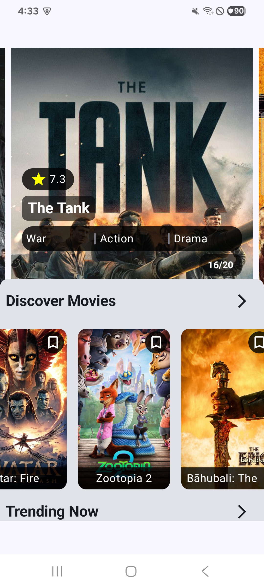
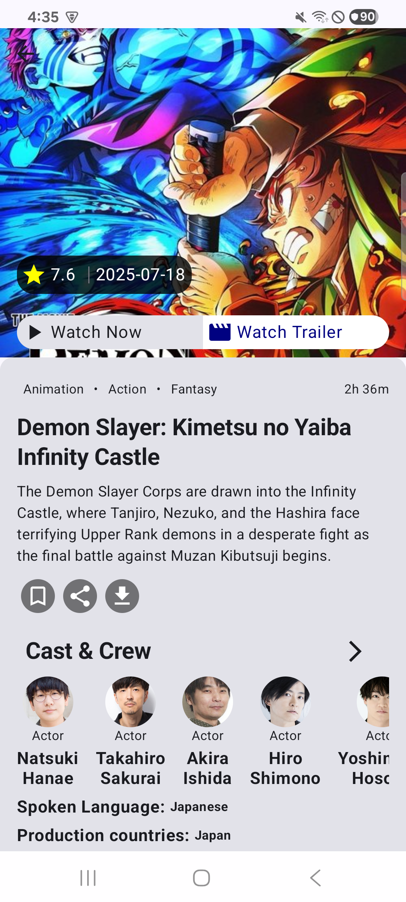
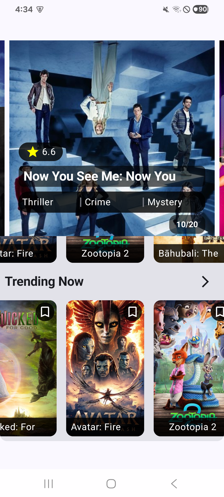
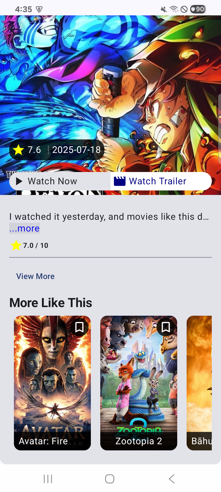

## Project Overview

This is an Android movie browsing application built with modern Android development practices. It is a single-module project named "JetMovie".

The application fetches movie data from the TMDb API, including movie details, trending movies, and actor information. It uses a `Response` wrapper class to handle loading, success, and error states for API calls.

## Screenshots

| Home | Detail |
| --- | --- |
|  |  |
|  |  |


## Tech Stack & Architecture

*   **UI:** Jetpack Compose for a declarative UI.
*   **Architecture:** Single-activity architecture with a ViewModel-centric approach.
*   **Asynchronous Operations:** Kotlin Coroutines for managing background threads.
*   **Dependency Injection:** Hilt for managing dependencies.
*   **Networking:** Retrofit and OkHttp for making API calls to The Movie Database (TMDb).
*   **Image Loading:** Coil for loading and displaying images.
*   **Data Parsing:** Kotlinx Serialization for parsing JSON responses from the TMDb API.

## Project Structure

The `app` module is organized by feature, with a focus on separating data, domain, and UI layers.

```
src
└── main
    └── java
        └── com
            └── yoon
                └── openmovie
                    ├── di/                 # Dependency Injection modules
                    ├── movie/              # Movie list feature
                    │   ├── data/
                    │   └── domain/
                    ├── movie_detail/       # Movie detail feature
                    │   ├── data/
                    │   └── domain/
                    └── ui/                 # Jetpack Compose UI
                        ├── components/     # Shared UI components
                        ├── detail/         # Detail screen UI
                        ├── home/           # Home screen UI
                        └── navigation/     # Navigation graph
```

## Building and Running

### Prerequisites

*   Android Studio
*   Java Development Kit (JDK)
*   An API key from [The Movie Database (TMDb)](https://www.themoviedb.org/documentation/api)

### Configuration

1.  Create a `local.properties` file in the root of the project.
2.  Add your TMDb API key to the `local.properties` file:
    ```
    TMDB_API_KEY="YOUR_API_KEY"
    ```

Alternatively, you can open the project in Android Studio and run the `app` configuration.

## Development Conventions

*   **Dependency Management:** Dependencies are managed using the `libs.versions.toml` file in the `gradle` directory. This provides a centralized way to manage dependency versions.
*   **Coding Style:** The codebase follows standard Kotlin coding conventions.
*   **API Constants:** API-related constants, such as base URLs and endpoints, are stored in the `K.kt` file.
*   **Genre Mapping:** Movie genre IDs are mapped to their names in the `GenreConstants.kt` file.
*   **API Response Handling:** API responses are wrapped in a `Response` sealed class to handle different states (Loading, Success, Error).

